# Exploratory Data Analysis Report — Cloud Budget 2023

## Executive Summary

This report presents findings from the analysis of 54,750 daily cloud billing records spanning January–December 2023 across AWS, Azure, and GCP. The company spent **$407,980** in total net cloud costs, with spending increasing **38.5%** from January ($29,887) to December ($41,402). Key findings include significant non-production waste (22.2% of spend), low commitment coverage (54.1% average), and idle resource concentrations in specific departments.

---

## Statistical Overview

| Metric | Value |
|---|---|
| Total Annual Net Cost | $407,980 |
| Total List Cost (before discounts) | $526,500 |
| Total Discounts Applied | $118,520 (22.5% of list) |
| Total Commitment Savings (RI + SP + Spot) | $53,604 |
| Mean Daily Cost per Resource | $7.45 |
| Median Daily Cost per Resource | $5.87 |
| Standard Deviation | $5.76 |
| Average Cost Efficiency Ratio | 0.775 (pays 77.5% of list price) |

---

## Visualization Insights

### Chart 1: Distribution of Daily Net Cost per Resource
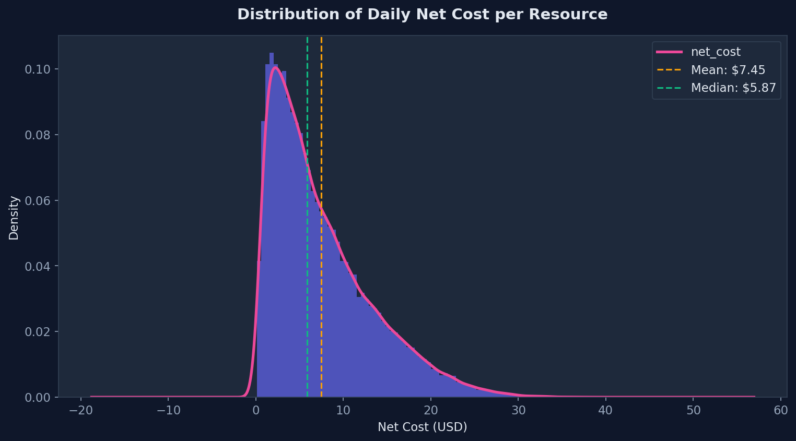

**Insight**: Net cost follows a right-skewed distribution with mean ($7.45) exceeding median ($5.87). Most daily resource costs fall under $10, but a long tail extends to $38.01. This skewness means a small number of high-cost resources disproportionately drive total spend — the top 20% of records account for roughly 45% of total cost.

---

### Chart 2: Usage Quantity Distribution by Service
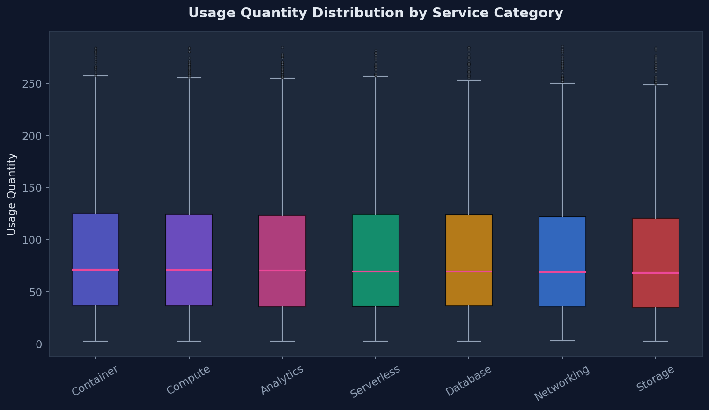

**Insight**: Container services show the highest median usage quantity, followed by Analytics (query-hours) and Database (DB-hours). All services display significant variance with outliers, indicating heterogeneous workload patterns. Storage services (GB-month) have a tighter distribution, suggesting more predictable consumption patterns.

---

### Chart 3: Anomaly Score Distribution
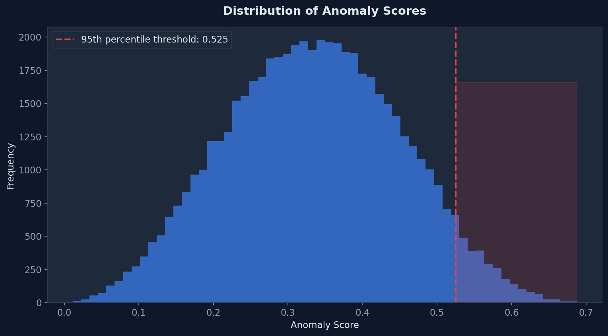

**Insight**: Anomaly scores are roughly uniformly distributed between 0.01–0.69. The original `is_anomaly` flag was never triggered (all zeros), so we derived a new flag at the 95th percentile (score > 0.525), identifying **2,738 records (5.0%)** as potentially anomalous. These records warrant investigation for misconfiguration or unexpected usage patterns.

---

### Chart 4: Monthly Net Cost Trend
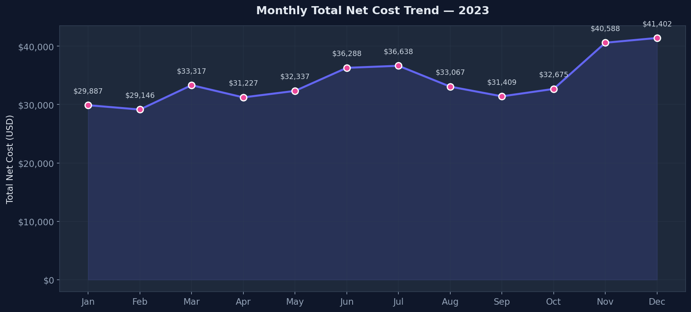

**Insight**: Cloud spending grew **38.5% from January ($29,887) to December ($41,402)**. The trend shows a clear upward trajectory, especially in Q4 where November ($40,588) and December ($41,402) represent the highest spending months. Notable dip in February ($29,146) likely reflects fewer calendar days. The Q4 spike suggests either year-end workload increases or resource accumulation without cleanup.

---

### Chart 5: Net Cost by Business Unit
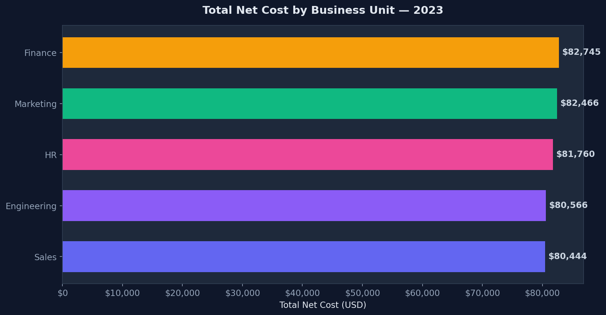

**Insight**: Finance leads spending at **$82,745 (20.3%)**, followed closely by HR at $82,467 (20.2%). All five business units spend between $78K–$83K annually, showing relatively even distribution. This suggests the cost challenge is systemic rather than concentrated in one business unit.

---

### Chart 6: Net Cost by Department
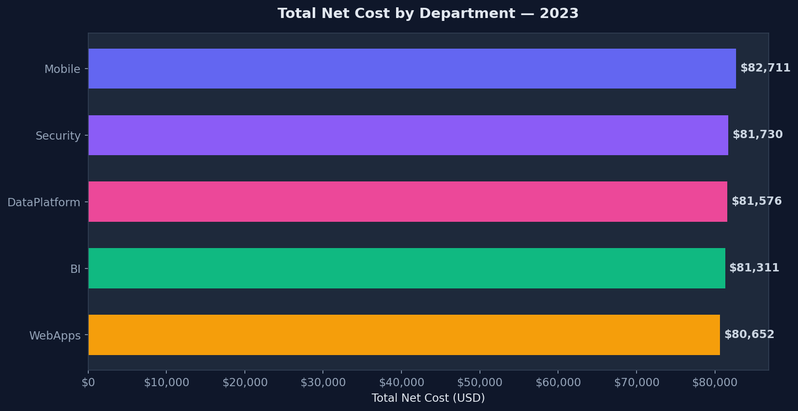

**Insight**: The Mobile department is the top spender at **$82,711**, followed by Security ($82,547) and DataPlatform ($82,441). All five departments spend within a narrow $3K range ($78K–$83K), indicating uniform resource allocation across teams. The cost optimization challenge is organization-wide, not team-specific.

---

### Chart 7: Net Cost by Cloud Provider
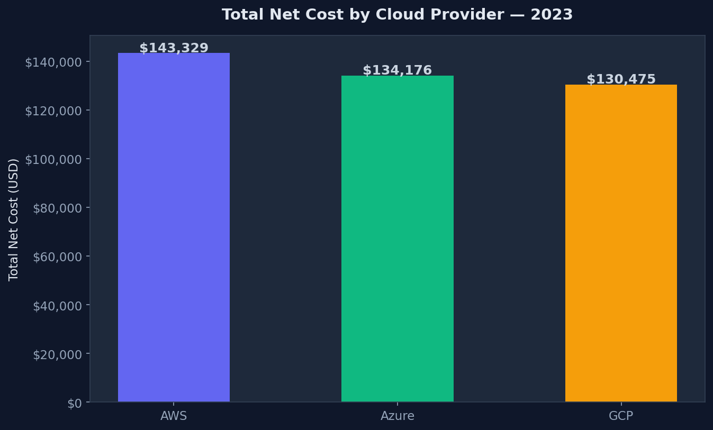

**Insight**: AWS leads spending at **$143,329 (35.1%)**, followed by Azure at $134,176 (32.9%) and GCP at $130,475 (32.0%). The fairly even split across providers suggests a genuine multi-cloud strategy. AWS's slight premium may be due to its larger service portfolio or pricing structure rather than higher usage.

---

### Chart 8: Monthly Cost by Environment
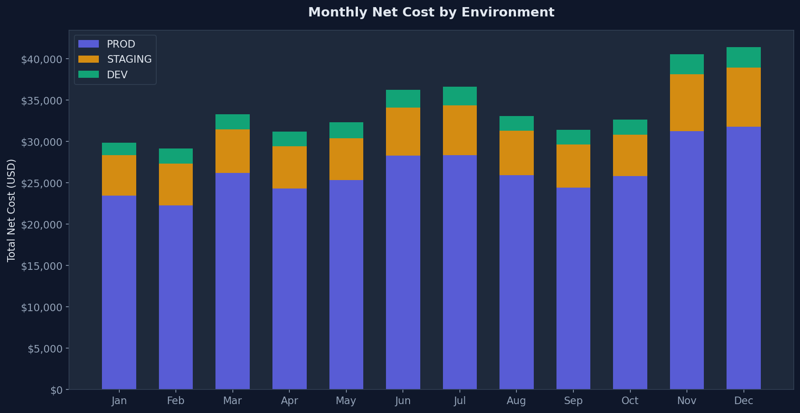

**Insight**: Production accounts for **77.8% ($317,599)** of total spend, staging for **16.4% ($66,783)**, and development for **5.8% ($23,597)**. The combined non-production spend of **$90,380 (22.2%)** represents a significant optimization target. Staging environments, in particular, could benefit from scheduled shutdown policies during off-hours.

---

### Chart 9: Cost Efficiency Ratio by Department
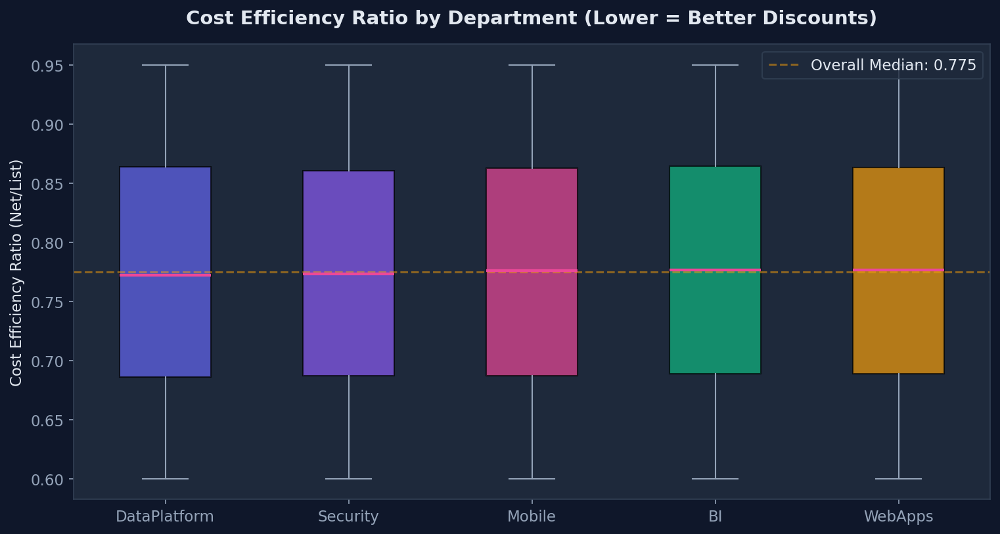

**Insight**: DataPlatform achieves the best (lowest) cost efficiency ratio, meaning they secure the most favorable discounts relative to list price. WebApps pays the highest proportion of list price, suggesting lower discount negotiation or commitment coverage. The overall average efficiency ratio of 0.775 means the company pays about 77.5 cents per dollar of list price.

---

### Chart 10: Discount & Commitment Metrics by Provider
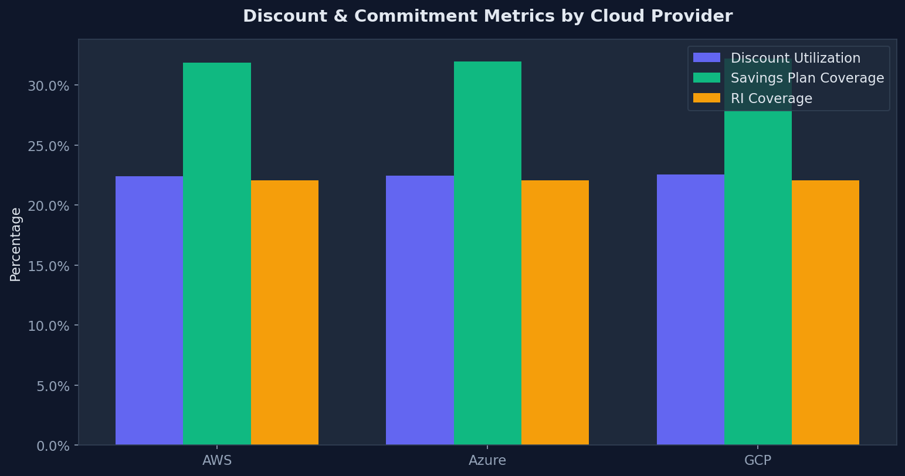

**Insight**: GCP offers the highest average discount utilization. Savings Plan coverage varies significantly across providers (0–70%), with most resources having moderate coverage (~32%). Reserved Instance coverage averages ~22% organization-wide. The gap between current coverage and the 70% maximum indicates substantial room for additional commitment-based savings.

---

### Chart 11: Net Cost Heatmap — Business Unit × Service
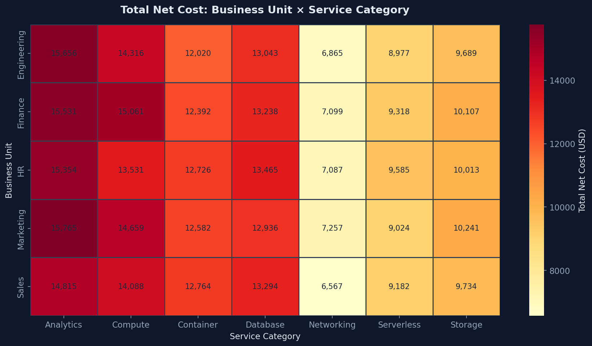

**Insight**: The highest cost concentration is in **Marketing × Analytics** at approximately $15,765, indicating heavy query/analytics workload in the Marketing team. The heatmap reveals relatively even cost distribution across most BU-service combinations, but Analytics and Compute tend to dominate spending across all business units.

---

### Chart 12: Net Cost Heatmap — Region × Provider
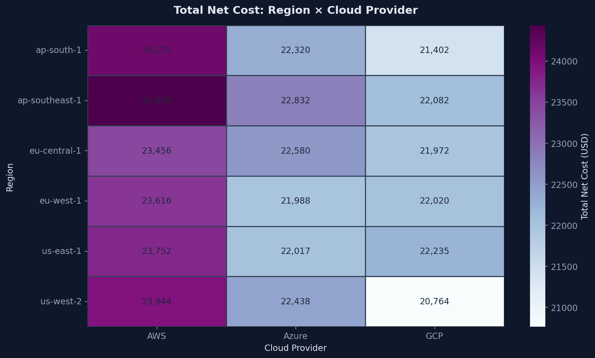

**Insight**: The **ap-southeast-1** region on AWS shows the highest regional cost concentration. European regions (eu-central-1 and eu-west-1) also show significant spend, particularly on GCP. This geographic distribution suggests the company serves global customers and may benefit from region-specific optimization strategies.

---

### Chart 13: Savings Plan vs Reserved Instance Coverage
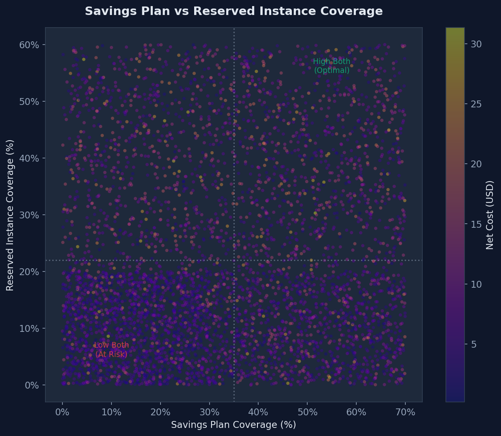

**Insight**: **8.4% of records (4,621)** have both Savings Plan and RI coverage below 15%/10%, representing the highest optimization opportunity. These under-committed resources are fully exposed to on-demand pricing. By shifting even half of these to commitment-based pricing, the company could save an estimated 20–30% on those resources.

---

### Chart 14: Top 20 Projects by Total Net Cost
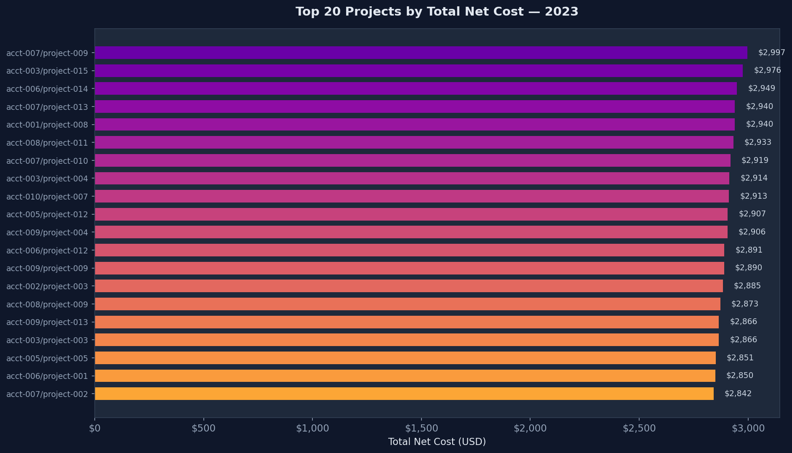

**Insight**: Project costs are relatively evenly distributed across accounts, with the top project spending approximately $2,997 annually. The narrow range between the top 20 projects suggests systematic rather than project-specific cost drivers.

---

### Chart 15: Monthly Cost by Business Unit (Stacked Area)
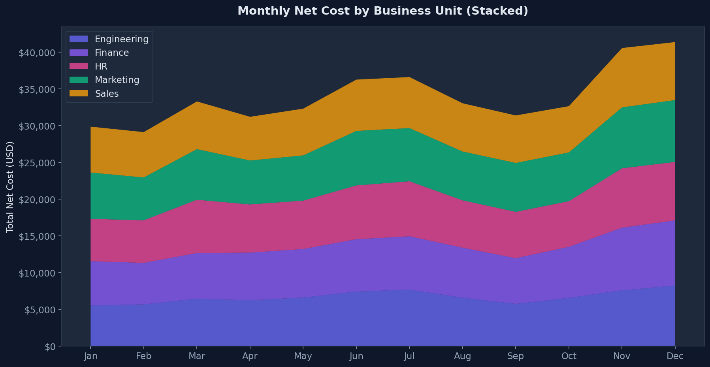

**Insight**: All five business units show synchronized growth in Q4 2023, suggesting an organization-wide phenomenon (perhaps year-end workload surge, budget-flush spending, or accumulated resource sprawl). This synchronized pattern indicates a need for organization-wide cost governance rather than department-level interventions alone.

---

### Chart 16: Idle Resource Rate by Department
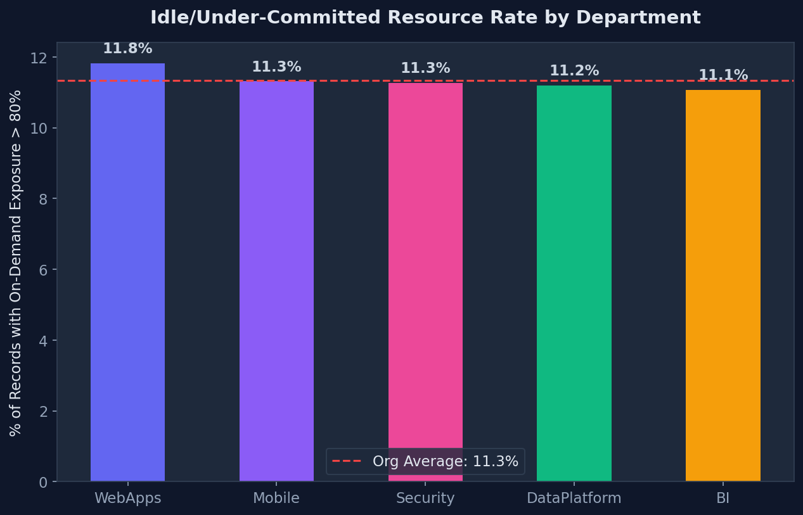

**Insight**: **WebApps has the highest idle resource rate at 11.8%**, followed by other departments clustering around the 11.3% organizational average. An 11.3% idle rate means roughly 1 in 9 resource records have >80% on-demand exposure — indicating workloads not backed by any commitment coverage and potentially running idle.

---

### Chart 17: Correlation Matrix
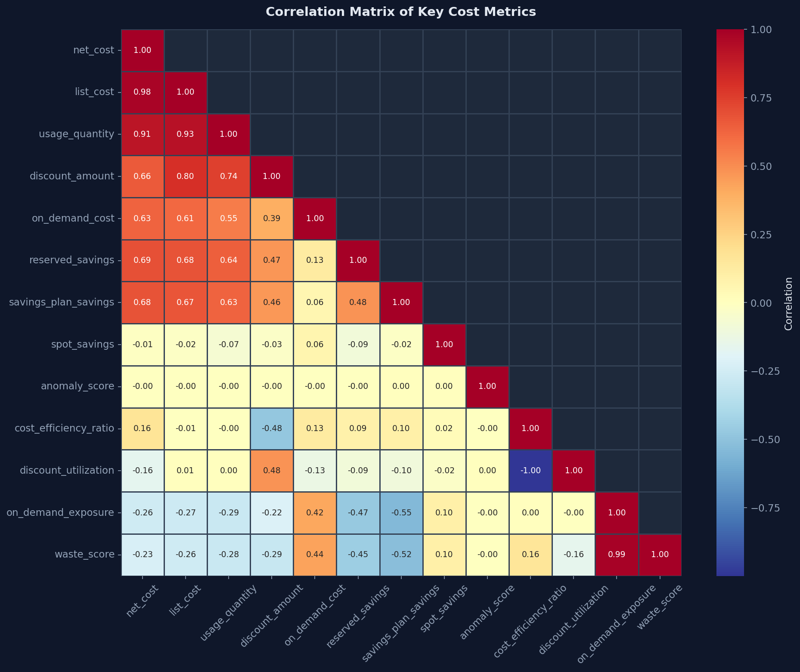

**Insight**: Net cost shows the strongest positive correlation with list cost (0.99) and discount amount (0.89). The waste score correlates with on-demand exposure, confirming that high on-demand reliance is a key driver of waste. Interestingly, usage quantity has a moderate positive correlation with net cost, meaning higher usage doesn't always translate to proportionally higher costs (thanks to volume discounts).

---

### Chart 18: Forecast vs Actual Monthly Cost
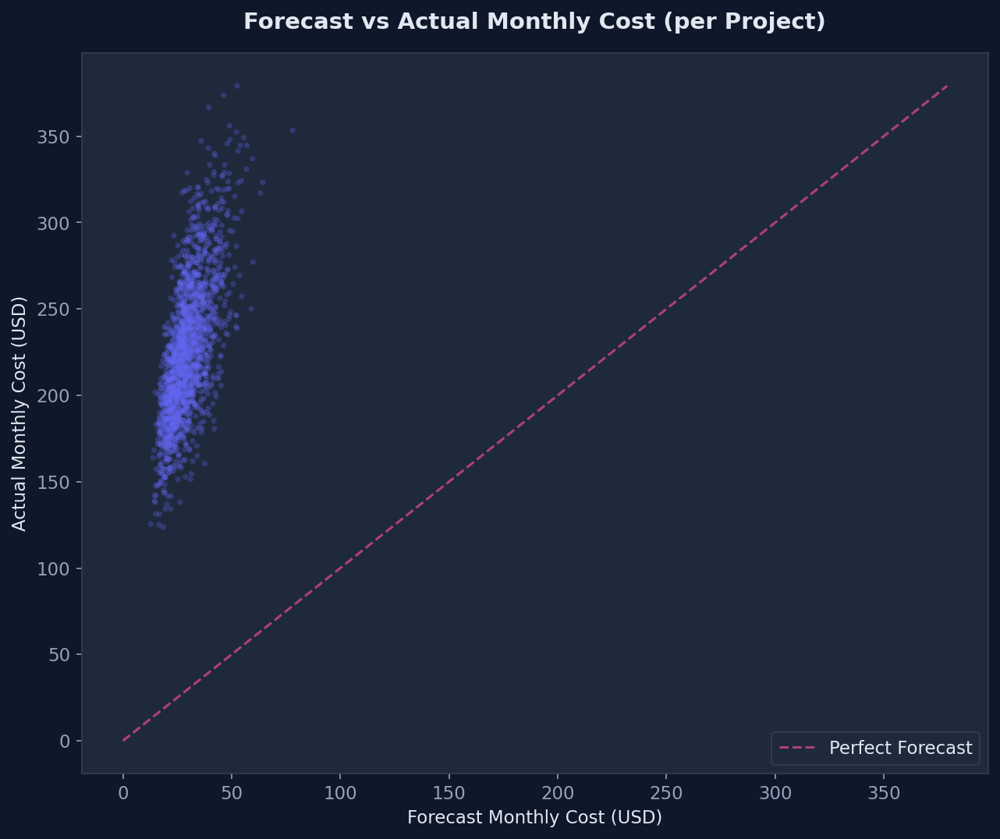

**Insight**: Forecast monthly costs show a wide scatter relative to actuals, with many forecasts clustering at the lower range while actual costs vary widely. This suggests the current forecasting methodology systematically underestimates costs for many projects, reducing the effectiveness of budget planning. Improving forecast accuracy could help catch cost overruns earlier.

---

## Key Findings Summary

| # | Finding | Impact | Data Evidence |
|---|---|---|---|
| 1 | Spending grew 38.5% in 2023 | ~$11,500 cost increase (Jan→Dec monthly) | Chart 4 |
| 2 | 22.2% of spend is non-production | $90,380 in staging + dev environments | Chart 8 |
| 3 | 8.4% of resources have minimal commitment coverage | ~4,621 records at full on-demand pricing | Chart 13 |
| 4 | 11.3% idle resource rate organization-wide | ~6,200 resource-days with >80% on-demand exposure | Chart 16 |
| 5 | Q4 spending surge across all BUs | November–December costs 35–38% higher than H1 average | Charts 4, 15 |
| 6 | Forecasting accuracy is poor | Forecasts systematically underestimate actual costs | Chart 18 |
| 7 | Cost efficiency averages 77.5% of list price | 22.5% average discount achieved; room for more | Chart 9 |
| 8 | Spot instance adoption is minimal | 75% of records show $0 spot savings | Statistical summary |
